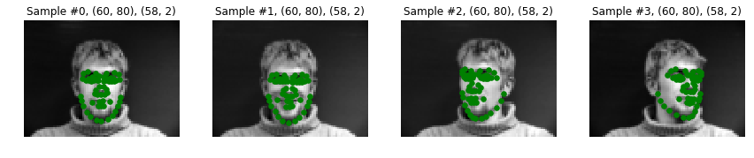
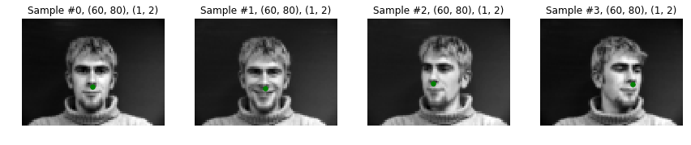
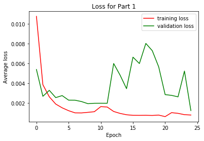
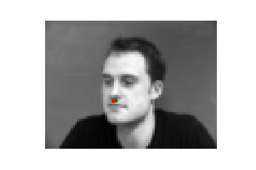
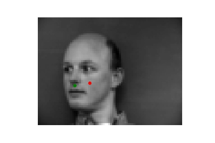
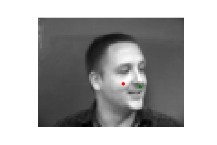

## CS 194-26 Project 4: Facial Keypoint Detection with Neural Networks

### Part 1: Nose Tip Detection

In this part, all we had to do was design and train a simple convolutional neural network to detect the point directly under a person's nose.

First, I had to make sure I was loading the ground-truth values correctly. The results of this can be seen below, along with the results from showing just the nose key-point.

Now that I knew I was loading the images and labels properly, I was able to start training. I chose to use a 3-layer network, with 12 7x7 filters for conv1, 16 5x5 filters for conv2, and 32 3x3 filters for conv3. I was first resizing the images to be 60 by 80 (as opposed to 480 by 640) for speed, so this results with the first fully connected layer having input size 32x4x7=896. I chose an output size of 256, leaving the last fc layer to have input 256 and output 2.

My training results are shown below. We can see that around 10 epochs, our model's loss gets worse temporarily, but then recovers to find a lower minima by 25 epochs.

This simple model seems to work decently, successfully detecting the nose point even on images of faces that are not from straight on. However, it also mislabels a lot of noses. This is probably because of insufficient training time, overfitting to training data, or a not complex enough model. Since this model is simply a proof-of-concept for latter parts of the project, though, its performance is sufficient.

Some example results are shown below. Green is the ground-truth, and red is the network's output.

<table>
  <tr>
    <td> Works </td>
    <td>  </td>
    <td>  </td>
  </tr>
  <tr>
    <td> Do not work </td>
    <td>  </td>
    <td>  </td>
</table>
