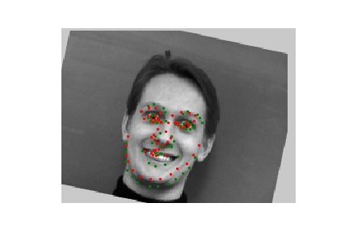
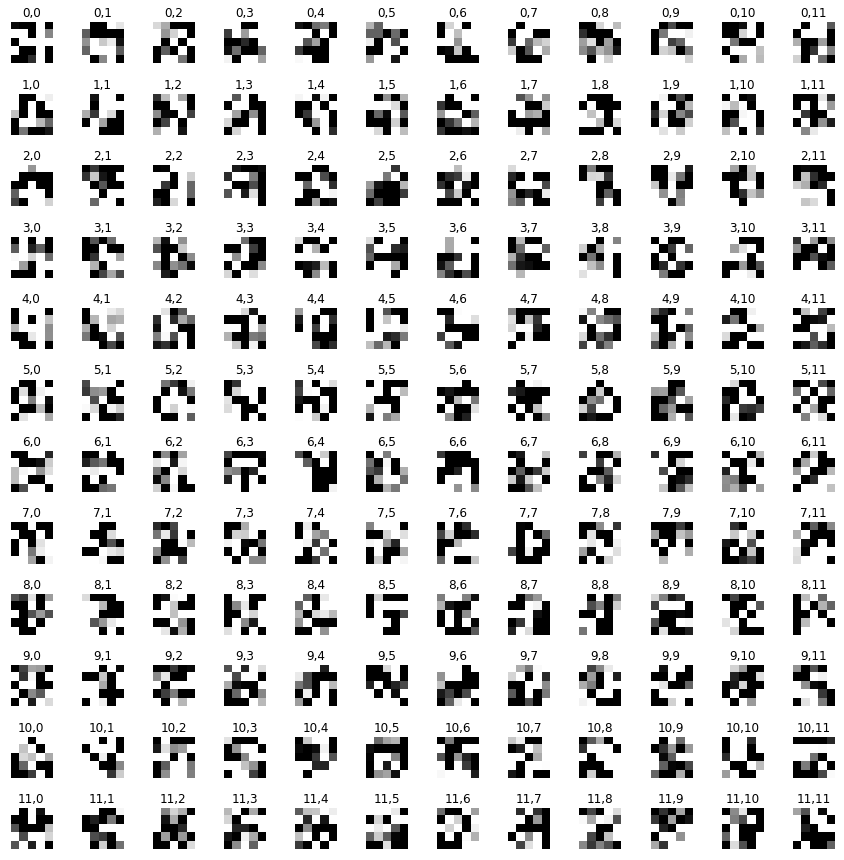

## CS 194-26 Project 4: Facial Keypoint Detection with Neural Networks

### Part 1: Nose Tip Detection

In this part, all we had to do was design and train a simple convolutional neural network to detect the point directly under a person's nose.

First, I had to make sure I was loading the ground-truth values correctly. The results of this can be seen below, along with the results from showing just the nose key-point.

Now that I knew I was loading the images and labels properly, I was able to start training. I chose to use a 3-layer network, with 12 7x7 filters for conv1, 16 5x5 filters for conv2, and 32 3x3 filters for conv3. I was first resizing the images to be 60 by 80 (as opposed to 480 by 640) for speed, so this results with the first fully connected layer having input size 32x4x7=896. I chose an output size of 256, leaving the last fc layer to have input 256 and output 2.

My training results are shown below. We can see that around 10 epochs, our model's loss gets worse temporarily, but then recovers to find a lower minima by 25 epochs.

This simple model seems to work decently, successfully detecting the nose point even on images of faces that are not from straight on. However, it also mislabels a lot of noses. This is probably because of insufficient training time, overfitting to training data and therefore not generalizing well to validation data, or a not complex enough model. Since this model is simply a proof-of-concept for latter parts of the project, though, its performance is sufficient.

Some example results from performance on the validation set are shown below. Green is the ground-truth, and red is the network's output.

<table>
  <tr>
    <td> Works </td>
    <td>  </td>
    <td>  </td>
  </tr>
  <tr>
    <td> Do not work </td>
    <td>  </td>
    <td>  </td>
</table>

### Part 2: Full Facial Keypoints Detection

Now that we've shown we can use a convolutional neural network to detect the nose point, we can generalize this to all the facial keypoints by just increasing the output dimension of our final fully connected layer. In this case, we would have an output of size 58x2=116.

This time, we also added some data augmentation to add both robustness and help prevent overfitting to training data. I chose to implement random rotation and random shifting. 

To validate I was doing augmentation correctly, I first tested to see if the new ground-truth labels of augmented data were correct. This can be shown below.

I made the model slightly more complicated this time, and increased the input image size. I settled on input size 240x180 and a model with 6 convolutional layers, all with 5x5 filters. The first two had 12 filters, the next two had 20, and the last two had 32. As with before, there were two fully connected layers at the end that ultimately give us the output of 116 numbers corresponding to the predicted keypoints.

The training looks a lot smoother than in part 1. We do see, however, that the model isn't really learning until after epoch 10, after which we see training and validation loss both going down.

<table>
  <tr>
    <td> Works </td>
    <td>  </td>
    <td>  </td>
  </tr>
  <tr>
    <td> Do not work </td>
    <td>  </td>
    <td>  </td>
</table>

As with before, we can see that detecting facial keypoints works better in some cases than in others. Some of the more interesting failure cases, which I've included above, seem to come from the model's outputs being affected by shadows, particularly from beneath the chin, pulling all the predicted keypoints downwards.

Something interesting we can do is to try and visualize the filters. 

<table>
  <tr>
    <td> Conv1 </td>
    <td>  </td>
  </tr>
  <tr>
    <td> Conv2 </td>
    <td>  </td>
</table>

Most of the filters actually don't look like much. But, conv1's 3.0 and 4.0 seem to detect something about horizontal edges, and 6.0 responds to vertical edges. For conv2, we see more complicated patterns that are much harder to make any sense of.

